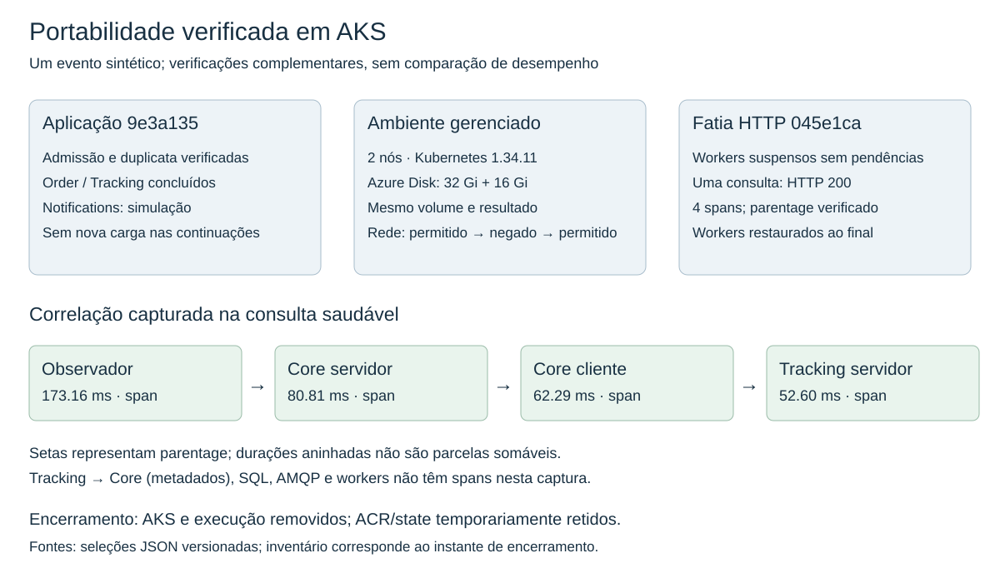
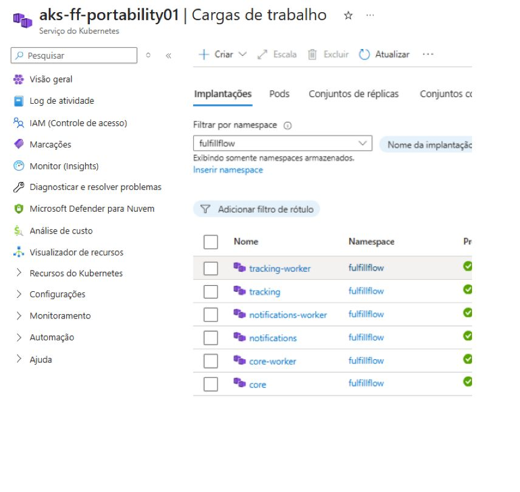
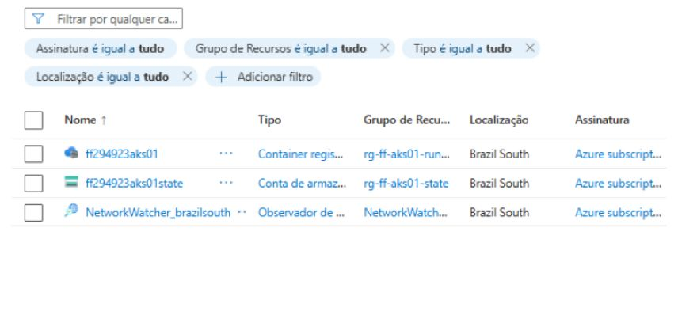

# Portabilidade operacional do FulfillFlow para AKS

## 1. Resultado e escopo

A referência funcional do FulfillFlow foi implantada em Azure Kubernetes Service
(AKS) e confirmou o fluxo sintético selecionado, a verificação de duplicata, a
preservação do resultado e do volume PostgreSQL após intervenções e o efeito de
uma regra de rede. Uma extensão separada confirmou a correlação de quatro spans
HTTP da derivação instrumentada, com os três workers temporariamente suspensos.
O cluster e seus recursos de execução foram removidos após preservar as evidências.

O problema operacional é transportar uma aplicação já avaliada em Kubernetes
local para um ambiente gerenciado sem presumir que imagem, armazenamento,
identidade e rede sejam equivalentes. O funcionamento dos serviços precisa ser
confrontado com seus contratos; a criação do cluster e a prontidão de pods não
substituem a confirmação de negócio. A pergunta desta etapa foi:

> Quais adaptações operacionais são necessárias para portar a referência local
> para AKS, preservando o fluxo funcional selecionado e, de forma complementar,
> uma capacidade de correlação HTTP já validada?

Esta é uma **verificação delimitada de portabilidade**, realizada em 28/09/2026,
com um evento sintético e consultas subsequentes do mesmo resultado. Não é uma
campanha de desempenho, teste de produção ou repetição na nuvem das avaliações
de recuperação e capacidade. A captura HTTP saudável não repete a falha controlada
da avaliação local de observabilidade.

**Figura 1.** Síntese derivada das seleções JSON. As setas entre spans representam
relações de parentage; as durações se sobrepõem e não formam parcelas aditivas.

## 2. Método e referências

### 2.1. Ambiente efetivamente exercitado

| Elemento | Configuração / referência |
| --- | --- |
| Aplicação funcional | [`9e3a135a00db218643633c7165d3106f0c8285e1`](https://github.com/campos-labs/fulfillflow/tree/9e3a135a00db218643633c7165d3106f0c8285e1), congelada nas avaliações anteriores |
| Derivação instrumentada | [`045e1ca8629409b6abdf2829ef5c93d14cfb60d9`](https://github.com/campos-labs/fulfillflow/tree/045e1ca8629409b6abdf2829ef5c93d14cfb60d9); SDK/OTLP HTTP 1.45.0; opt-in nas rotas selecionadas |
| Infraestrutura | Extensão de `v1.2.0-rc.1` (`777900d`); overlay AKS separado; auxiliares em `scripts/azure/`; orquestradores locais identificados por hash |
| Cluster | Brazil South, AKS Base / Free, Kubernetes 1.34.11; um system pool com dois `Standard_D4s_v6`, sem autoscaling |
| Nós | 4 vCPU/16 GiB nominais por nó; 3.860 millicores alocáveis por nó; Ubuntu, disco SO Managed de 64 GiB |
| Processos | APIs e workers de Core, Tracking e Notifications, inicialmente uma réplica de cada; PostgreSQL e RabbitMQ em StatefulSets |
| Imagens | ACR Basic na mesma assinatura; referências por digest; admin do registry desabilitado |
| Dados | Novos volumes Azure Disk CSI, Standard SSD LRS: PostgreSQL 32 GiB e RabbitMQ 16 GiB; RWO, classe `fulfillflow-retain` |
| Rede e acesso | Azure CNI Overlay/Cilium; API Kubernetes restrita ao IP autorizado; aplicação sem ingresso público; consultas por túnel local |
| Estado de infraestrutura | Backend Blob exclusivo, Entra e chaves distintas por root Terraform; state e entradas sensíveis fora do pacote público |

Os [digests](evidence/aks-portability/records/basic/images.json) identificam as
imagens utilizadas. O digest funcional começa em `582a858d`; o instrumentado em
`aaf3cb4c`. São referências distintas: portar a fatia instrumentada não significa
que todos os processos da implantação básica passaram a exportar traces.
Configuração ARM, nós e volumes estão nas [seleções do ambiente](evidence/aks-portability/README.md).

O render de `kind-local` permaneceu idêntico à `v1.2.0-rc.1` nas fases foundations,
migrations e runtime, conforme a [comparação preservada](evidence/aks-portability/records/basic/kind-regression.json).
Isso protege os manifestos anteriores; não demonstra equivalência de recursos ou
causalidade entre ambientes. A implantação AKS tem recursos e topologia de nós
próprios. Não se transportaram tempos, throughput ou conclusões quantitativas do Kind.

### 2.2. Procedimento e unidades de observação

O procedimento separou bootstrap/state, ACR e imagens, cluster, foundations,
migrations e runtime. O smoke confirmou admissão, duplicata e resultados públicos
do evento. As etapas posteriores reutilizaram esse resultado: não constituem
novas repetições independentes do fluxo nem novas ofertas de negócio.

A persistência comparou identidades de pod, PVC, PV e volume CSI e os estados de
Order, Shipment, Tracking e Notifications. A recriação controlada afetou somente
`postgres-0`. Uma captura posterior falhou; a continuação leu o mesmo evento após
parada/retomada do AKS, sem nova recriação do banco. Essa intervenção intermediária
integra o resultado e limita sua interpretação.

A rede foi examinada por três probes TCP ao mesmo pod PostgreSQL: origem com o
rótulo `fulfillflow.io/database-client=true`,
origem sem esse rótulo e origem permitida novamente, sem alterar as NetworkPolicies.
O controle positivo posterior reduz a ambiguidade de atribuir toda falha de conexão
à indisponibilidade do destino. O teste cobre essa fronteira e essas origens,
não todas as combinações de tráfego do cluster.

A extensão OTel utilizou clones diagnósticos de Core/Tracking e um receptor OTLP
delimitado, sem Azure Monitor/Application Insights. Após confirmar ausência de
trabalho pendente nos três bancos e nas filas, os três workers foram suspensos.
Houve uma consulta GET saudável ao evento concluído; a verificação funcional foi
feita independentemente dos spans. Os diagnósticos foram removidos e os workers
restaurados antes do encerramento. Não houve injeção de falha HTTP.

## 3. Resultados

| Verificação | Evidência observada | Alcance |
| --- | --- | --- |
| Fluxo funcional | Admissão e duplicata verificadas; Order concluído, Tracking aplicado e Notifications simulado | Um evento sintético; não mede capacidade ou taxa de sucesso geral |
| Persistência | Mesmo PVC, PV, volume e resultado; UID de `postgres-0` mudou | Preservação através das intervenções registradas; não é restore de backup nem HA |
| Rede | Conectou → não conectou → conectou; UID do destino estável | Efeito na fronteira PostgreSQL testada; não é auditoria integral de isolamento |
| Identidade/imagens | Imagens ACR por digest e workloads prontos com identidade kubelet; operação pelo usuário Entra | Caminhos exercitados; federação GitHub/Writer preparada não equivale a deploy CI testado |
| OTel isolado | HTTP 200; quatro spans no mesmo trace com parentage verificado; resultado funcional confirmado | Portabilidade da captura saudável, sem workers ativos durante a consulta |
| Restauração do diagnóstico | Oito objetos diagnósticos removidos; três workers restaurados; seis deployments prontos | Encerramento do ensaio isolado, sem workload diagnóstico residual |
| Remoção da execução | AKS/grupo gerenciado ausentes; inventário e listagem de discos conferidos | Inventário pontual; não implica ausência de qualquer recurso na assinatura |

Fontes: [smoke](evidence/aks-portability/records/basic/smoke.json),
[persistência](evidence/aks-portability/records/basic/persistence-review.json),
[rede](evidence/aks-portability/records/basic/network.json) e
[probes](evidence/aks-portability/records/basic/network-probes.json),
[OTel](evidence/aks-portability/records/http/review.json) e
[encerramento](evidence/aks-portability/records/closure/summary.json).

### 3.1. Aplicação, persistência e rede

As consultas públicas confirmaram `FULFILLED`, `DELIVERED`, `APPLIED` e `SIMULATED`
nas fronteiras correspondentes. O volume PostgreSQL manteve seu vínculo apesar
da substituição do pod e da retomada do cluster. O RabbitMQ apresentou volume
vinculado de 16 GiB, mas não foi submetido a uma verificação independente de
recriação/recuperação nesta etapa. A soma de 48 GiB é capacidade provisionada,
não volume de dados efetivamente utilizados.

**Figura 2.** Captura real do Portal, com namespace `fulfillflow`, antes da suspensão
dos workers. O JSON preservado registra seis deployments `1/1`. O cabeçalho da conta
foi excluído no momento da captura; o recorte limita algumas colunas. Indicadores
de carregamento de CPU/memória não são medições e não foram usados na análise.

As capturas adicionais de armazenamento corroboram volumes vinculados de 32 e
16 GiB. Capturas com deployments `0/1` ou pods pendentes não têm horário
verificável suficiente para atribuir causa e não comprovam o aceite final. A presença da página “Monitor (Insights)” tampouco
comprova que ingestão paga de Azure Monitor tenha sido configurada.

### 3.2. Capacidade para o diagnóstico e consulta OTel

A primeira tentativa de extensão, `otel-healthy-01`, foi recusada antes de criar
os diagnósticos: havia 0,550 e 0,458 vCPU disponíveis para requests nos dois nós,
totalizando 1,008, frente a 1,050 vCPU solicitadas. Isso caracteriza insuficiência
de margem de agendamento na amostra, **não saturação medida de CPU**. Não houve
evidência de memória insuficiente nessa checagem.

O diagnóstico isolado foi uma adaptação explícita posterior. Suspender os três
workers liberou seus requests para a consulta de um evento já concluído, mantendo
nós, SKU e requests da fatia. As [contagens anteriores](evidence/aks-portability/records/http/pending-before.json)
e [posteriores à suspensão](evidence/aks-portability/records/http/pending-after.json)
estavam zeradas; não foi introduzido novo trabalho de negócio.

| Span | Duração registrada |
| --- | ---: |
| Observador cliente | 173,16 ms |
| Core servidor | 80,81 ms |
| Core cliente → Tracking | 62,29 ms |
| Tracking servidor | 52,60 ms |

O receptor aceitou três lotes e registrou quatro spans esperados, sem lotes
rejeitados nessa captura. A relação observador → Core servidor → Core cliente →
Tracking servidor foi verificada nos IDs. Essas durações descrevem uma consulta;
não estimam overhead nem desempenho típico. Não se somam spans aninhados e não se
subtraem tempos de serviços diferentes para inferir commit SQL ou espera exata.

A consulta de metadados Tracking → Core não tem span próprio; SQL, AMQP e workers
continuam fora da cobertura. A coleta demonstrou portabilidade dessa fronteira
HTTP, não rastreamento completo da aplicação. Como os workers estavam suspensos,
o resultado não demonstra coexistência da instrumentação com todos os processos
ativos nem justifica reduzir permanentemente seus recursos.

## 4. Encerramento e inventário

O registro da janela vai de 07:12:40 a 09:16:23 UTC em 28/09/2026, incluindo pausas
e retomadas. Esse intervalo não corresponde a horas contínuas de nós faturadas.
A infraestrutura de execução foi removida após preservar resultados, state,
referências de imagens, identidades de volumes e inventários.

O plano seletivo eliminou oito endereços Terraform: cluster, identidade de deploy,
federação GitHub e cinco atribuições de acesso associadas. O grupo gerenciado
de nós desapareceu; inventário ARM e listagem de discos corroboraram ausência
dos recursos de execução. A remoção seletiva não declara convergência integral
da configuração Terraform: um futuro `apply` pode propor recriação e precisa de
nova revisão. O parecer offline do plano tampouco constitui autorização para executar.

**Figura 3.** Portal após teardown: ACR, conta de state e Network Watcher regional
visíveis. A evidência primária é o inventário ARM combinado com ausência do grupo
gerenciado e listagem de discos. O registro de benefício da assinatura apareceu
na API e não nessa grade do Portal. Não se infere “assinatura vazia” pela figura.

O inventário final distingue recursos de execução removidos e recursos presentes
na captura de encerramento, incluindo ACR/backend e Network Watcher. Ele documenta
esse instante; não representa uma verificação de exclusão integral da assinatura.

## 5. Interpretação, adaptações e limites

| Fronteira | O que permaneceu | Adaptação / limite |
| --- | --- | --- |
| Aplicação | Imagem funcional e contratos do evento | Entrega por ACR/digest; não houve reescrita de negócio |
| Inicialização | Fases foundations, migrations e runtime | Backend e entradas Azure próprios; recursos novos, sem reutilizar volumes históricos |
| Persistência | Resultado após as intervenções | Azure Disk CSI substitui armazenamento local; continuidade não equivale a backup/HA |
| Identidade | Acesso autenticado aos serviços | Entra, kubelet/ACR e roles por escopo; autorização CI preparada não foi exercitada |
| Rede | Serviços privados e fronteiras declaradas | CNI Overlay/Cilium; efeito comprovado somente nos probes selecionados |
| Diagnóstico | Quatro fronteiras HTTP da derivação instrumentada | Falta de margem com todos os workers; execução isolada e saudável |
| Ciclo de vida | Preparar, verificar e preservar evidências | Stop/start, state remoto, inventário e remoção explícita com retenção residual |

O principal resultado não é a quantidade de adaptações, mas a correspondência
entre contratos definidos e verificações observadas. O fluxo funcional e uma
capacidade de correlação foram preservados no recorte observado após a mudança
de ambiente, sob adaptações de identidade, armazenamento e rede. A falta de margem
para os clones mostra que capacidade nominal dos nós não equivale à disponível para
instrumentação adicional; não demonstra um problema geral do OTel ou do AKS.

A continuidade com as avaliações anteriores é operacional: recuperação examinou
restauração de configuração; capacidade separou atendimento observado, pendência
local e pod-tempo; observabilidade delimitou processamento e consulta; esta etapa
verificou portabilidade de contratos selecionados e encerramento na nuvem. São
avaliações complementares sobre a mesma aplicação, com referências instrumentadas
explicitadas. Não foram executadas conjuntamente e não sustentam uma comparação
global de confiabilidade ou desempenho entre Kind e AKS.

As limitações materiais são: uma implantação e um evento, sem repetições para
inferência estatística; capturas sequenciais, não atômicas; parada/retomada entre
capturas de persistência; causa indeterminada da primeira consulta posterior;
OTel isolado, sem falha injetada e sem overhead medido; cobertura de rede e IAM
parcial. A primeira tentativa incompleta e a recusa
de capacidade permanecem nas evidências, sem serem convertidas retroativamente
em sucessos. As verificações não demonstram SLA, HA, backup restaurável, upgrade,
recuperação de nó ou prontidão para produção.

## 6. Limites e caminhos de continuidade

As continuidades se agrupam em quatro frentes, condicionadas a pergunta, protocolo
e custo próprios. Nenhuma é requisito desta entrega.

| Frente | Pergunta e possibilidades |
| --- | --- |
| Métricas e operação da telemetria | Como variam recursos, filas e saúde da coleta? Prometheus/Grafana podem apoiar séries; Azure Monitor/Application Insights, consulta e retenção gerenciadas. Medir overhead exige condições equivalentes e repetições; trocar o backend é outra intervenção |
| Correlação distribuída | Como acompanhar trabalho através de SQL, AMQP e persistência? OTel durável exige referência própria e revisão de contratos, sem alterar silenciosamente payloads assinados. Service mesh só cabe em comparação específica de cobertura |
| Segurança / DevSecOps | Que falhas e acessos indevidos são identificados em código, dependências, imagens, IaC e RBAC? Avaliar cobertura, falsos positivos e privilégio mínimo antes de criar bloqueios |
| Resiliência e operação contínua | Qual proteção acrescentam backup restaurável, zonas ou serviços gerenciados? Capacidade adaptativa e reconciliação por GitOps exigem protocolos próprios; preservação de um volume e números locais não antecipam esses resultados |

[Prometheus](https://prometheus.io/docs/introduction/overview/) fornece uma base
para métricas em séries temporais; não foi implantado nesta janela. O
[NIST SSDF 1.1](https://csrc.nist.gov/pubs/sp/800/218/final) oferece uma referência
de práticas para organizar eventual investigação de segurança, sem afirmar que
o projeto já atende integralmente ao framework. Essas referências orientam
possibilidades; os resultados deste relatório provêm dos registros executados.

## 7. Evidências e revisão

O [índice de evidências](evidence/aks-portability/README.md) reúne os dois ZIPs,
manifesto, imagens e instruções de conferência offline. Os registros preservam
IDs sintéticos e Kubernetes necessários à comparação; IDs ARM usam hashes estáveis.

É uma seleção sanitizada, sem credenciais, state, planos privados, imagens Docker
ou bancos. Hashes identificam fontes privadas, mas não as tornam inspecionáveis.
Os auxiliares são versionados; orquestradores locais são identificados por hash,
sem alegação de reexecução integral por um único comando público. A conferência
dos resultados não requer novos ensaios.

Identificação da entrega fica no
[plano de entrega](../RELEASE_PLAN.md).
