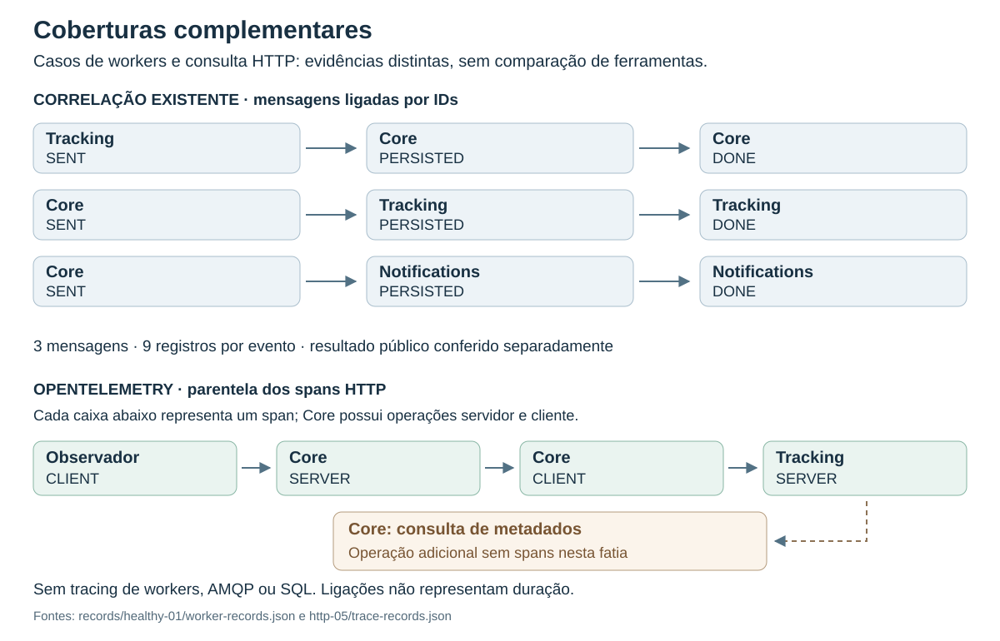
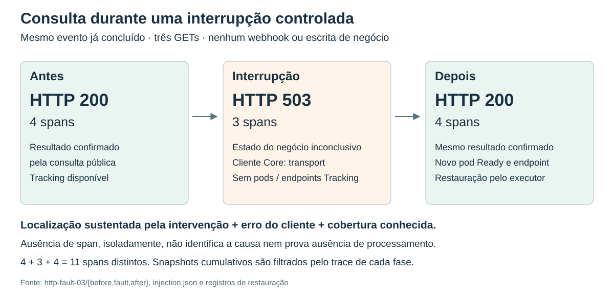

# Avaliação de correlação e diagnóstico HTTP

## 1. Resultado e escopo

**A correlação existente reconstruiu o caminho de dois eventos pelos workers;
a instrumentação OpenTelemetry acrescentou localização em uma fronteira HTTP.**
Uma sequência controlada confirmou a consulta do mesmo evento antes e depois de
interromper a API Tracking clonada: **200 → 503 → 200**, com **4 → 3 → 4 spans**.
O erro de transporte foi localizado no cliente Core, em conjunto com a intervenção
registrada. O estado do negócio permaneceu inconclusivo durante a consulta indisponível.

O problema operacional é distinguir trabalho pendente de dificuldade para consultar
seu resultado. A avaliação de capacidade já havia mostrado que pendência local e
confirmação do fluxo completo medem fronteiras diferentes. Aqui, a questão é:
**que informação a correlação entre aplicação e observador acrescenta ao diagnóstico
de um fluxo assíncrono e de suas consultas?**

O percurso foi selecionar sinais existentes, identificar a lacuna HTTP, instrumentar
somente essa fronteira e confrontar a captura com verificações funcionais e uma
intervenção conhecida. A entrega demonstra cobertura diagnóstica delimitada, sem
comparação de ferramentas, estimativa de overhead ou reconstrução das causas de
atrasos e erros históricos. Instalar tracing não foi o critério de sucesso.

## 2. Método e referências executadas

| Caso | Procedimento | Unidade e referência do executor |
| --- | --- | --- |
| Correlação saudável | Oferecer um evento e ligar estados públicos aos registros de três workers | Um evento novo; `7829064` |
| Correlação de pendência | Retirar Notifications worker antes da oferta, confirmar pendência e restaurar uma réplica | Outro evento novo; `974dbce` |
| HTTP saudável | Consultar o evento concluído do primeiro caso, com contexto propagado | Um GET, sem nova oferta; `d911bc7` |
| HTTP controlado | Consultar antes, durante a interrupção do clone Tracking e após sua restauração | Três GETs ao mesmo evento concluído; `416aef7` |

São dois casos de processamento e diagnósticos de consulta que reutilizam um deles.
Nove registros de um evento não são nove repetições. A seleção retrospectiva de um
evento de cada tentativa de capacidade em [discovery-01.json](evidence/observability/discovery-01.json)
é contexto exploratório, não ampliação da amostra desta avaliação.

| Identidade | Referência |
| --- | --- |
| Aplicação dos workers | [FulfillFlow v1.3.0-rc.1, `9e3a135`](https://github.com/campos-labs/fulfillflow/tree/9e3a135a00db218643633c7165d3106f0c8285e1) |
| Aplicação HTTP instrumentada | [Derivação da v1.3, `045e1ca`](https://github.com/campos-labs/fulfillflow/tree/045e1ca8629409b6abdf2829ef5c93d14cfb60d9); SDK e exportador OTLP HTTP 1.45.0, opt-in |
| Runtime HTTP | [Imagem, digest e lock](../config/http-observability.json); [protocolo saudável](evidence/observability/http-05/protocol.json) e [controlado](evidence/observability/http-fault-03/protocol.json) fixam as referências realmente executadas |
| Ambiente | Kind local sobre Docker/WSL, host Windows; ambiente de observabilidade próprio, sem bancos da campanha de capacidade; réplicas fixas, sem política de escala |
| Coleta | Registros por campos permitidos e consultas públicas; na fatia HTTP, receptor diagnóstico OTLP local e limitado, sem Collector completo ou dashboard |
| Operação | Guardas de 5 GiB disponíveis na entrada e 2 GiB durante execução HTTP; janela delimitada, sem retry das consultas de negócio; volumes preservados e nó parado ao final |

As APIs clonadas resolveram Core → Tracking e Tracking → Core entre si, mantendo
as APIs históricas intactas. A instrumentação abrange apenas a listagem pública
`/api/v1/carrier-events` e seu forwarding para `/internal/v1/tracking/carrier-events`.
O retorno de metadados da transportadora, de Tracking para Core, **não tem span
próprio**. Workers, SQL e AMQP não receberam tracing. A nova referência de runtime
não substitui as imagens congeladas das avaliações anteriores.

A validação funcional lê o JSON público e as identidades esperadas, sem consultar
spans. Na consulta saudável, verifica `PROCESSED` / `COMPLETED` e nove asserções;
`APPLIED` não é o status da inbox. Durante a falha esperada, a consulta reprova a
confirmação funcional, mas o diagnóstico pode passar se intervenção, erro, cobertura
e recuperação corresponderem ao protocolo. Não há leitura independente do caminho
interrompido durante essa fase.

IDs de evento, mensagem, requisição e trace têm funções distintas. Logs `DONE` e
campos de resultado não identificam o instante exato do commit. Durações monotônicas
pertencem ao processo que as mede; a incerteza de alinhamento UTC entre processos
não foi quantificada. Não se decompõe latência por subtração de medianas ou soma de
operações aninhadas. A captura exclui corpos HTTP, segredos, query strings e SQL.

## 3. O que os sinais existentes já explicavam

Nos dois casos, nove registros ligaram três mensagens aos mesmos IDs de admissão
e negócio: publicação `SENT`, recepção durável `PERSISTED` e processamento `DONE`.
As mensagens pertencem ao comando Tracking → Core, ao resultado Core → Tracking e
à notificação Core → Notifications. ACK após persistência técnica não significa
conclusão de negócio.

| Caso | Informação confirmada | Limite de interpretação |
| --- | --- | --- |
| Saudável | Tracking/Order concluídos; Notifications em `SIMULATED`; nove registros ligados a três mensagens; 13 requisições HTTP, zero erros | Um evento, sem medição de desempenho ou entrega externa |
| Pendência | Tracking/Order concluídos enquanto Notifications estava em `SENT/NOT_RECEIVED`; novo pod concluiu o mesmo evento sem reenvio; 15 requisições HTTP, zero erros | Trabalho aguardava consumo, sem retomada de processamento parcialmente executado |



*Figura 1 — Os registros sustentam relações diferentes: três mensagens ligadas por
IDs e quatro spans de uma consulta HTTP. As ligações representam cobertura e
parentela; não são uma escala temporal nem um trace distribuído dos workers.*

No cenário de pendência, o executor esperou o término do rollout antes de consultar
Notifications novamente. O `DONE` aparece em 10:54:17,021 UTC; a confirmação pública,
em 10:54:31,790 UTC. Essa espera foi parte do procedimento. O intervalo de 18,765 s
entre aceite e confirmação observada não representa apenas processamento e não
explica retrospectivamente os tempos de capacidade. Fontes: [registros do worker](evidence/observability/records/pending-02/worker-records.json),
[observações](evidence/observability/records/pending-02/event/observations.jsonl) e
[conferência](evidence/observability/pending-02-review.json).

A conclusão sem reenvio já havia sido verificada na recuperação. O acréscimo desta
etapa é a reconstrução dos elos e dos limites de observação, não uma nova comparação
de resiliência nem uma classificação de logs como superiores a traces.

## 4. Informação acrescentada pela captura HTTP

A consulta saudável produziu quatro spans com contexto e parentela conferidos:
observador cliente → Core servidor → Core cliente → Tracking servidor. O receptor
aceitou três lotes e rejeitou zero. A resposta 200 passou nas nove verificações
funcionais independentes. A [captura](evidence/observability/http-05/trace-records.json)
localiza a operação interna, antes agregada ao tempo total da consulta.

Os intervalos observados foram aproximadamente 152,6 ms no observador, 63,6 ms no
servidor Core, 45,6 ms no cliente interno e 42,3 ms no servidor Tracking. São spans
aninhados de **uma** consulta. Não se atribui o restante a rede, banco, agendamento ou
custo da instrumentação. O cliente registra recebimento da resposta e conferência
de Content-Type; isso não representa validação do schema JSON pelo forwarding.

### Falha conhecida e restauração

O executor reduziu somente `httpdiag-tracking` de uma para zero réplicas e aguardou
a ausência de pods, inclusive em encerramento, e de endpoints prontos. Core e o
receptor OTLP permaneceram disponíveis. Após a consulta de falha, restaurou o spec,
conferiu um novo pod Ready e endpoint disponível, e efetuou a consulta final.

| Fase | Consulta e captura | O que foi possível afirmar |
| --- | --- | --- |
| Antes | HTTP 200; quatro spans; resultado funcional aprovado | O evento conhecido já estava concluído |
| Interrupção | HTTP 503; três spans; `error.type=transport` no cliente Core, sem resposta remota | A consulta encontrou falha de transporte Core → Tracking, coerente com a intervenção; estado do negócio inconclusivo nessa fase |
| Depois | HTTP 200; quatro spans; mesmas identidades e resultado confirmado | A consulta voltou a funcionar após a restauração do clone |



*Figura 2 — Status e contagens derivados dos registros de cada fase da tentativa
`http-fault-03`. O evento é o mesmo e já estava concluído antes da intervenção.
A restauração foi executada pelo script, não por uma política automática.*

A localização depende do conjunto **intervenção registrada + erro explícito do
cliente + cobertura conhecida**. Ausência de span, sozinha, não comprova onde a
comunicação parou. Também não comprova ausência de processamento: a coleta pode ter
lacunas. Ao fim foram preservados onze spans distintos, oito lotes aceitos e zero
rejeitados. Os snapshots são cumulativos; o verificador filtra pelo `trace_id` de
cada fase, sem somar snapshots como consultas ou spans independentes.

### Síntese da cobertura

| Informação já disponível | Acréscimo da fatia instrumentada | Lacuna restante |
| --- | --- | --- |
| IDs e estados ligam mensagens, workers e resultado público | Parentela entre observador, servidor Core, cliente Core e servidor Tracking | Propagação durável de contexto por outbox/inbox e retomada não implementada |
| HTTP total e código de resposta identificam indisponibilidade | Erro de transporte localizado na operação cliente, confrontado com intervenção conhecida | SQL e chamada de metadados Tracking → Core não têm spans |
| Verificação funcional informa o resultado consultável | Traces explicam fronteiras da consulta sem decidir o resultado do negócio | Estado inconclusivo durante a falha; nenhuma demonstração de processamento sob indisponibilidade |
| Logs e consultas mostram marcos com semânticas próprias | Durações das operações HTTP escolhidas | Overhead, tempo exato de commit e decomposição completa da espera não medidos |

## 5. Validade e aprendizado preparatório

Os casos sustentam uma capacidade diagnóstica pequena e examinável. Não houve
condições equivalentes com e sem OTel, avaliadores independentes ou repetições para
medir acurácia, tempo de diagnóstico ou custo. A [API de métricas indisponível](evidence/observability/http-fault-03/resources.json)
impediu quantificar recursos; mesmo uma leitura pontual não estimaria overhead causal.
Aceitação pelo receptor e cobertura esperada não comprovam a saúde geral de todos
os exportadores ou ausência de perda em qualquer situação.

| Preparação | Aprendizado e tratamento |
| --- | --- |
| Inicialização e consultas anteriores à oferta | Guardas e qualificação dos caminhos foram corrigidas; falhas sem aceite confirmado não viraram eventos concluídos; [seleção de preparação](evidence/observability/records/preparation-failure-01/) |
| HTTP 02/03 | Capturas distinguiram resposta remota 503 e erro de transporte; não houve injeção controlada nem identificação da causa histórica; [oito arquivos e manifesto](evidence/observability/http-errors/) |
| HTTP 04 | Resposta 200 foi rejeitada por asserção incorreta de `APPLIED`; verificador corrigido prospectivamente; resultado anterior não reclassificado |
| Falha controlada 01/02 | Erro de leitura de endpoints vazios e, depois, consulta 200 apesar de zero endpoints; não produziram o diagnóstico pretendido; detalhes e disponibilidade no histórico abaixo |
| Falha controlada 03 | Protocolo passou a exigir remoção efetiva dos pods; sequência 200/503/200 confirmada, com restauração verificada |

A tentativa com zero endpoints e consulta 200 mostrou que a configuração aplicada
não basta para comprovar o efeito experimental. Reutilização de conexão e convergência
da rede permaneceram hipóteses não isoladas. Não se repetiram campanhas para perseguir
503 históricos. O [histórico imutável](https://github.com/campos-labs/fulfillflow-infra/blob/f6aafa0/RELEASE_PLAN.md#4-exploração-de-observabilidade)
preserva os protocolos, emendas e julgamentos; os originais de falha controlada 01/02
e séries completas do host continuam locais, sem equivalência de disponibilidade com
os pacotes publicados.

Liberação pontual de cache Linux, com workloads parados, e recuperação autorizada
de Docker/WSL ocorreram na preparação identificada no histórico. Nenhuma intervenção
desse tipo durante a medição foi adotada como procedimento. Esses diagnósticos não
comparam executores, equipamentos ou ganhos decorrentes da preparação do host.

## 6. Interpretação e caminhos de continuidade

A observabilidade existente e o tracing cobriram partes complementares do sistema.
Os IDs permitiram reconstruir processamento assíncrono nos casos escolhidos; OTel
acrescentou localização à consulta síncrona. A falha controlada demonstrou a distinção
entre indisponibilidade de consulta e ausência de confirmação do negócio naquele
instante. O alcance termina nessas fronteiras: não há ganho geral de diagnóstico,
menor custo ou causa histórica demonstrados.

A [recuperação](OPERATIONAL_EVALUATION.md), a [capacidade](SCALING_EVALUATION.md) e
este diagnóstico contribuem para uma questão operacional comum: **que evidência
sustenta uma intervenção automatizada e a confirmação de seu resultado?** As duas
primeiras avaliações examinam intervenção; esta examina informação disponível para
interpretar o sistema. Os protocolos são separados e não testam conjuntamente
recuperação, escala e tracing. Comparações arquiteturais antigas da aplicação não
substituem estas evidências; seus contratos identificados explicam os mecanismos.

A avaliação está encerrada neste escopo. As alternativas abaixo dependem de uma
lacuna e de uma decisão própria; nenhuma é requisito de fechamento.

| Possibilidade | Pergunta e condição para avançar |
| --- | --- |
| Métricas com Prometheus; Grafana se útil | Quanto custa instrumentar? Exige séries confiáveis da aplicação, observador e coleta, mais condições equivalentes; dashboard não cria a métrica ausente |
| OTel em SQL/AMQP e trabalho persistido | Onde o contexto se perde entre publicação, persistência e retomada? Exige referência própria e decisão antes de modificar payloads, esquema, retries ou contratos |
| Segurança na entrega | Que cobertura e custo oferecem verificações de código, dependências, imagens e IaC? SAST/SCA/scanners são opções por função; achados, falsos positivos e tratamento precisam de critérios próprios |
| AKS/ACR | A referência funciona em Kubernetes gerenciado? Começar por portabilidade e integrações necessárias, com orçamento e encerramento definidos; números locais não se tornam medições de nuvem |
| Service mesh | Que informação de comunicação acrescentaria à instrumentação da aplicação, a que custo? Só considerar diante dessa pergunta; não é necessário para os resultados atuais |

A documentação de [propagação de contexto do OpenTelemetry](https://opentelemetry.io/docs/concepts/context-propagation/)
fundamenta a distinção entre IDs e spans relacionados. [Dapper](https://research.google/pubs/dapper-a-large-scale-distributed-systems-tracing-infrastructure/)
trata utilidade do tracing e baixo overhead como objetivos distintos: aqui foi
verificada cobertura, enquanto custo permanece aberto. A [telemetria interna do Collector](https://opentelemetry.io/docs/collector/internal-telemetry/)
é referência para uma eventual coleta maior, não descrição do receptor mínimo usado.
[Prometheus](https://prometheus.io/docs/introduction/overview/) e
[NIST SSDF 1.1](https://csrc.nist.gov/pubs/sp/800/218/final) orientam, respectivamente,
séries de métricas e práticas de desenvolvimento seguro; não validam os resultados
do laboratório nem prescrevem adotar uma lista de ferramentas.

## 7. Evidências e reprodução da leitura

O [índice de evidências](evidence/observability/README.md) reúne **dois ZIPs**, hashes
e registros JSON/JSONL legíveis no GitHub. Os pacotes são cópias de transporte das
seleções publicadas, sem dependência de `artifacts/` para conferir os resultados
principais. Não incluem bancos, imagens, kubeconfigs, credenciais ou logs irrestritos.

| Afirmação | Registro original e campo relevante |
| --- | --- |
| Três mensagens correlacionadas | [worker-records](evidence/observability/records/healthy-01/worker-records.json): `message_id`, `correlation_id`, `event_id`, `request_id` |
| Pendência e conclusão sem reenvio | [observações](evidence/observability/records/pending-02/event/observations.jsonl): `pending_confirmed`, `notifications_simulated`; [troca de pod](evidence/observability/records/pending-02/worker-transition.json) |
| Consulta saudável independente | [functional](evidence/observability/http-05/functional.json): `functional_checks`; [trace-records](evidence/observability/http-05/trace-records.json): `trace_id`, parentela e atributos |
| Interrupção efetiva e erro | [injection](evidence/observability/http-fault-03/injection.json): ausência de pods/endpoints; [fault/trace-records](evidence/observability/http-fault-03/fault/trace-records.json): cliente Core `error.type=transport` |
| Restauração e mesmo evento | [restoration](evidence/observability/http-fault-03/restoration.json), [novo pod](evidence/observability/http-fault-03/restored-pod.json), [after/functional](evidence/observability/http-fault-03/after/functional.json) |

Os `review.json` são conferências derivadas; os manifestos identificam os bytes dos
originais selecionados. Alguns resumos antigos ainda dizem “somente local”: essa era
a disponibilidade quando produzidos. O índice atual especifica o que foi publicado.
Em `http-fault-03/protocol.json`, `query_count=3` define a sequência; o valor 1 dentro
de `runtime` pertence à configuração da consulta unitária reutilizada, não ao total.

Na raiz do repositório, com as dependências congeladas instaladas:

```powershell
uv run --frozen python docs/evidence/observability/reproduce.py
```

A conferência reproduz julgamentos dos casos, verifica manifestos e conteúdo dos
ZIPs, e compara as duas figuras com a geração a partir dos dados versionados. Não
acessa Docker, rede, configuração privada ou aplicação. Para reconstruir apenas os
pacotes e diagramas, acrescentar `--write`; isso não executa novos ensaios. Diagramas
representam cobertura e estados, não screenshots de uma plataforma inexistente.
Scripts operacionais permanecem em `scripts/`; comandos e guardas no
[guia Kubernetes](../k8s/README.md#diagnóstico-http-com-tracing). Reproduzir esta leitura
não garante recriar o runtime/hardware ou repetir o comportamento em outro ambiente.
