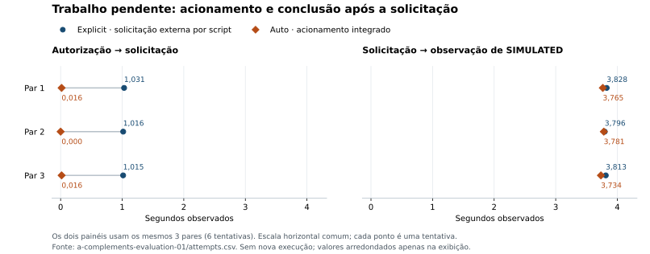

# Avaliação operacional da restauração em Kubernetes

## 1. Resultado e escopo

A avaliação verificou benefícios e limites do acionamento automático de uma
restauração delimitada, mantendo a mesma aplicação e o mesmo verificador nas duas
condições. O Plano A foi concluído em Kind: a série A2-03 teve 20 tentativas
utilizáveis; os complementos tiveram seis tentativas com pendência e três com
observação inconclusiva, em protocolo separado.

Ambos os procedimentos restauraram a configuração elegível e confirmaram o fluxo.
Nos complementos, ambos confirmaram a conclusão posterior do trabalho que aguardava
consumo. A diferença temporal concentrou-se entre a autorização/decisão e a
solicitação registrada de restauração, sob os mecanismos de coordenação utilizados.
A condição explícita foi acionada por script: os tempos não medem reação humana.

Os três casos de inconclusão preservaram a configuração da candidata saudável e
permitiram consultar posteriormente os mesmos eventos. Isso verifica a regra de
abstenção diante da falha de consulta injetada; não demonstra segurança universal
nem recuperação de uma falha de implantação simultaneamente encoberta.

A intervenção alterou somente `notifications-worker`, com uma réplica e sem mudar
imagem, aplicação, schema, probes ou demais workloads. A falha `DB_POOL_SIZE=0`
impediu a inicialização. Ela já era identificável no estado/diagnóstico do pod;
não foi demonstrada vantagem adicional de detecção pelo verificador funcional.
Não houve AKS/ACR, autoescalonamento, entrega externa de notificação ou comparação
entre versões da aplicação.

## 2. Referências e método

### Identidade da execução

| Item | Referência |
| --- | --- |
| Aplicação | [FulfillFlow v1.3.0-rc.1](https://github.com/campos-labs/fulfillflow/tree/9e3a135a00db218643633c7165d3106f0c8285e1), SHA `9e3a135a00db218643633c7165d3106f0c8285e1` |
| Imagem local executada | `fulfillflow-kind-runtime:source-9e3a135a00db`; ID `sha256:cc882fab4e5294ed7e516131a1b4ace90a2d7e019467ca5c929b14381b680daa` |
| Ambiente | Kind v0.30.0, Kubernetes v1.34.0, um nó em Docker Linux/WSL no Windows; [versões fixadas](../config/kind-toolchain.json) |
| Runtime | Três APIs, três workers, PostgreSQL com três bancos/roles e RabbitMQ; configuração [Kind](../k8s/overlays/kind-local) |
| A2-03 | Infra `08a68234932557f29c65911cab17f850adc4b23d`; [CI](https://github.com/campos-labs/fulfillflow-infra/actions/runs/36088273634) |
| Complementos avaliação 01 | Infra `f7a6111bffd2e2ce736a1560dbd957dadb6cb806`; [CI](https://github.com/campos-labs/fulfillflow-infra/actions/runs/36195418341) |

As execuções do cluster foram locais; a CI verificou código, contratos, manifests
e planos Terraform simulados. A aprovação da CI não equivale à execução das séries.
Os [contratos da política](../DESIGN.md#85-a2--restauração-automatizada-de-runtime-em-kind)
e o [procedimento operacional](../k8s/README.md#a2--operação-delimitada) permanecem
separados deste registro de resultados.

### Condições e protocolos

`explicit` usa uma solicitação externa registrada por subprocesso; `auto` integra
o acionamento ao executor. Detector, configuração saudável, restauração e
verificador são comuns. Ordem, prazos e código foram fixados antes das execuções.
O cenário saudável precedeu a falha na série A2; os pares alternaram qual condição
começou. Nos complementos: explicit/auto, auto/explicit, explicit/auto, seguidos
pelos três casos de inconclusão. Não houve randomização.

| Protocolo | Tentativas | Evento acompanhado | Origem dos tempos e observação |
| --- | --- | --- | --- |
| A2-03 saudável | 5 pares, 10 tentativas | Evento novo na candidata saudável; limpeza posterior separada | Intenção de aplicar candidata → decisão funcional; sem restauração pela política |
| A2-03 falha de startup | 5 pares, 10 tentativas | Nenhum evento oferecido à candidata defeituosa; evento novo depois da restauração | Decisão → solicitação → convergência → verificação funcional sequencial |
| Complemento pendência | 3 pares, 6 tentativas | Evento já aceito, Tracking/Order concluídos e Notifications `SENT/NOT_RECEIVED` | Preparação → autorização → solicitação; observadores de convergência e negócio em paralelo |
| Complemento inconclusão | 3 tentativas auto | Evento aceito em candidata saudável; 503 injetado no transporte da consulta | Decisão inconclusiva, conferência de ausência de mutação e consulta posterior dos mesmos IDs |

**Pendência e convergência analisam as mesmas seis tentativas.** Não são duas
amostras independentes. Smokes adicionais e duplicatas intencionais também não
acrescentam repetições. Os conjuntos A2 e complementos não são combinados nas
medianas nem numa taxa geral de sucesso.

Rollout e fluxo tiveram prazo de 90 s; operação, 600 s; polling de observação, 1 s.
A solicitação externa foi assistida por script com polling de 0,1 s. A2 reservou
30 min para encerramento em janela de até quatro horas; complementos, janela de
45 min. Os protocolos registram os limites efetivos. No A2, log vazio após término
do processo pode ser relido por até 5 s, com identidade conferida, dentro da detecção.
Isso não repete a implantação. Não houve atraso artificial exclusivo de uma condição.

As durações usam relógio monotônico com origem identificada; UTC serve à correlação.
Não se subtraem relógios de processos distintos. O início A2 é
`candidate_send_intent`, não a confirmação de aplicação. Nos complementos,
`policy_authorized` vem depois da preparação e do início dos dois observadores.
**Autorização até conclusão não é a duração completa da indisponibilidade.**

Antes/depois de cada tentativa foram conferidas identidades e configuração; dados
sintéticos novos foram acrescentados sem apagar o histórico. O estado acumulado,
um único host e a ordem fixa limitam independência e generalização. Alimentação AC,
ausência de containers concorrentes e inibição temporária de suspensão foram
controladas pelo executor, sem comprovar monitoramento contínuo de todo o host.

## 3. Acionamento e restauração da configuração

Na série A2-03, as dez candidatas saudáveis foram aprovadas sem restauração pela
política. As dez candidatas com falha de startup foram rejeitadas, cada uma com
uma restauração e confirmação funcional. Uma recuperação aprovada não muda o
veredito de reprovação da candidata. A limpeza explícita das candidatas saudáveis
ocorreu fora da avaliação da política e não conta como restauração indevida.

Medianas em segundos, cinco tentativas por condição em cada cenário:

| Intervalo registrado | Explicit | Auto |
| --- | ---: | ---: |
| Saudável: intenção de aplicar → decisão funcional | 21,735 | 21,547 |
| Falha: intenção de aplicar → decisão de rejeição | 6,203 | 6,188 |
| Falha: decisão → solicitação de restauração | 1,078 | 0,062 |
| Falha: solicitação → convergência saudável | 18,765 | 18,797 |
| Falha: solicitação → confirmação funcional | 21,906 | 21,937 |
| Falha: intenção de aplicar → encerramento da política | 29,094 | 27,016 |

Fonte: [tentativas A2](evidence/operational-a/a2-comparison-03/attempts.csv) e
[resumo original](evidence/operational-a/a2-comparison-03/summary.json), com
mínimos, máximos e diferenças pareadas. As medianas das etapas não devem ser somadas.

A condição integrada dispensou a solicitação externa separada. Depois da solicitação,
os tempos de convergência e confirmação funcional ficaram próximos. Não se isolou
quanto da diferença de acionamento corresponde a subprocesso, polling ou outras
etapas de coordenação. Os dados não sustentam significância estatística,
produtividade humana ou superioridade geral de desempenho.

## 4. Conclusão posterior do trabalho aceito

Nos seis complementos de pendência, a preparação confirmou HTTP 202, Tracking/Order
concluídos e Notifications publicado, mas ainda não recebido. Só então a política
pôde agir. O worker defeituoso não havia iniciado o processamento desse evento;
essa verificação não demonstra recuperação de trabalho parcialmente executado ou
persistido após ACK nele.

As seis tentativas concluíram os mesmos eventos em `SIMULATED`, observados por GET,
com um efeito de Tracking e uma Notification por evento. Ambos os procedimentos
permitiram essa confirmação. Nove smokes adicionais com duplicatas passaram no
encerramento dos nove complementos; não integram a amostra de pendência.

| Mediana em segundos, n=3 por condição | Explicit | Auto |
| --- | ---: | ---: |
| Autorização → solicitação | 1,016 | 0,016 |
| Solicitação → primeira observação de `SIMULATED` | 3,813 | 3,765 |
| Autorização → primeira observação de `SIMULATED` | 4,828 | 3,781 |

Fonte: [tentativas dos complementos](evidence/operational-a/a-complements-evaluation-01/attempts.csv).
As diferenças pareadas auto menos explicit no último intervalo foram -1,078,
-1,031 e -1,078 s. A diferença após solicitação é pequena frente ao polling de
observação e não sustenta processamento mais rápido.

A figura mostra os mesmos três pares em dois intervalos; linhas ligam membros do
par, não uma evolução temporal. Fonte: CSV acima; segundos observados, sem inferência
sobre tempo de reação humana. Os valores próximos de zero não significam ação instantânea.

## 5. Observação inconclusiva e sinais de conclusão

Nas três candidatas saudáveis com 503 injetado na consulta de Notifications, a
política se absteve: zero intenção/envio de restauração durante a decisão,
UID/geração/template/referências preservados e consulta GET posterior aprovada para
os mesmos IDs. A limpeza explícita ocorreu depois dessas verificações. Serviços,
armazenamento e cluster eram reais; a falha foi gerada no transporte do observador,
sem derrubar a API. Não houve combinação com falha de implantação.

A abstenção cumpriu a regra de não alterar a configuração sem diagnóstico elegível.
Ela não prova ausência de defeito em todo cenário inconclusivo nem compara políticas
alternativas para falhas simultâneas. O 503 injetado não explica incidentes anteriores
da aplicação.

Nos seis casos de pendência, `SIMULATED` foi observado de **14,172 a 15,594 s antes**
da convergência composta da revisão saudável; mediana de 15,406 s. Ambos os
observadores começaram antes da autorização. O sinal de infraestrutura reúne
revisão, imagem, réplicas e readiness, não o instante exato de transição de Pod Ready.
As consultas têm duração e polling; não foi isolada a causa desse intervalo.

Esse resultado mostra que conclusão de negócio e convergência são verificações
complementares. Não demonstra inadequação das probes nem autoriza concluir que
negócio sempre termina antes da prontidão. A observação paralela difere da sequência
A2: os aproximadamente 3,8 s dos complementos não representam melhoria sobre os
aproximadamente 21,9 s da confirmação sequencial de outro evento no A2.

## 6. Interpretação e limites operacionais

| Operação | Alcance |
| --- | --- |
| Reversão de transação | Desfaz alterações não confirmadas dentro daquela transação local |
| Restauração de configuração | Reaplica o template conhecido; não desfaz dados, efeitos confirmados, migrations, volumes ou secrets |
| Conclusão da pendência | Depende dos mecanismos persistentes, das dependências e da política de tentativas da aplicação |

A infraestrutura restabeleceu a configuração elegível; os mecanismos da aplicação
permitiram concluir o trabalho; o verificador confirmou identidades e efeitos.
Trabalho `BLOCKED` pode exigir rearme auditável, fora do A2. Os complementos não
verificaram esse rearme. `SIMULATED` é resultado terminal de simulação, sem entrega
externa ou promessa de exactly-once no transporte.

O conjunto sustenta uma política que distingue falha elegível, resultado inconclusivo
e confirmação funcional, com recuperação limitada e rastreável. A vantagem temporal
observada ficou no acionamento; a conclusão posterior dos eventos foi comum às
duas condições. Zero restaurações indevidas nas candidatas saudáveis e três
abstenções corretas descrevem esses casos; não estimam taxa de falhas em produção.

Limites principais: uma aplicação, um workload, um tipo de falha de startup,
um nó/host, amostras pequenas e estado acumulado. Não foram avaliados perda do nó,
restauração de backup, falhas simultâneas, alterações de schema, escala, carga de
capacidade, operação prolongada ou AKS. As extensões possíveis estão no
[plano de entrega](../RELEASE_PLAN.md#3-extensões-possíveis), não constituem resultados.

### Contratos da aplicação e alcance das verificações

A referência técnica é o [DESIGN da v1.3 congelada](https://github.com/campos-labs/fulfillflow/blob/9e3a135a00db218643633c7165d3106f0c8285e1/DESIGN.md).
Ele explica admissão durável, outboxes/inboxes, ACK anterior ao processamento local,
idempotência e estados terminais. Contrato descrito não é execução demonstrada;
código de teste também não substitui seu registro de execução. As afirmações deste
relatório se apoiam nas tentativas Kind identificadas, sem importar medições ou
comparações de versões anteriores.

A [demonstração da aplicação](https://github.com/campos-labs/fulfillflow/blob/9e3a135a00db218643633c7165d3106f0c8285e1/docs/DEMO.md)
e suas capturas ilustram a interface da referência. Não são capturas destas tentativas
nem evidência de execução no Kind. Ensaios anteriores de bootstrap/reinício e testes
de guardas são antecedentes técnicos; sua [síntese histórica](https://github.com/campos-labs/fulfillflow-infra/blob/47dbd111ad4eff89a8e64c7b50d7d2c59c23baf7/RELEASE_PLAN.md)
identifica registros locais e limitações. Não entram nos denominadores comparativos.

## 7. Exclusões e correções do instrumento

| Conjunto | Tratamento e motivo |
| --- | --- |
| A2 série 01, `9acb798` | Incompleta na tentativa 11 após dez saudáveis; diagnóstico de startup não confirmado. Correção posterior permitiu reler log vazio por prazo limitado, sem recuperar o log original ausente |
| A2 série 02, `6ee2093` | Incompleta na tentativa 18: projeção intermediária válida de Tracking rejeitada pelo verificador. Correção passou a aguardar o terminal preservando identidade; consulta posterior não recuperou o horário original nem validou retroativamente a tentativa |
| Pilotos A1/A2 | Preparação e validação do executor; não são repetições da série 03 |
| Complementos piloto 01 | Resultados funcionais preservados; identificação herdada de cenário corrigida antes do piloto sucessor |
| Complementos piloto 02 | Três pilotos aprovados, usados como requisito de liberação; excluídos das nove tentativas de avaliação |

Não houve reposição de tentativas, combinação de séries incompletas ou reclassificação
posterior para completar amostra. Os registros permanecem locais; detalhes e referências
anteriores estão no histórico Git acima. Falhas do instrumento não foram tratadas
como prova de falha da aplicação nem apagadas da rastreabilidade.

## 8. Evidências e reprodução da leitura

Os dados em [docs/evidence/operational-a](evidence/operational-a) estão versionados
junto deste relatório. O [manifesto](evidence/operational-a/manifest.json) identifica
origem, hash, natureza de cada arquivo e disponibilidade dos pacotes completos.
Projeções são seleções declaradas dos originais; conferências e resumos calculados
não substituem os registros dos quais derivam. Os originais locais não foram alterados.
A pasta de evidências não sofre conversão automática de finais de linha pelo Git,
preservando os bytes e SHA-256 declarados entre plataformas.

| Afirmação | Fonte e campo relevante | Natureza e disponibilidade |
| --- | --- | --- |
| A2: condições, ordem e prazos | [Protocolo A2](evidence/operational-a/a2-comparison-03/protocol.projection.json); `order`, `deadlines_seconds`, `provenance` | Projeção versionada; protocolo integral no pacote local |
| A2: contagens e medianas | [CSV](evidence/operational-a/a2-comparison-03/attempts.csv); `scenario`, `condition`, `usable`, intervalos; [resumo](evidence/operational-a/a2-comparison-03/summary.json) | Cópias originais versionadas; resumos são agregações do executor |
| Complementos: preparação, ordem e limites | [Protocolo](evidence/operational-a/a-complements-evaluation-01/protocol.json); `preparation`, `authorization`, `order`, `limits` | Original versionado |
| Complementos: tempos e resultados por tentativa | [CSV](evidence/operational-a/a-complements-evaluation-01/attempts.csv) e [resumo](evidence/operational-a/a-complements-evaluation-01/summary.json) | Cópias originais versionadas; números das tabelas recalculados por condição |
| A2: origem dos intervalos | [Cronologia](evidence/operational-a/a2-comparison-03/chronology.projection.json); `attempts[i].policy_window`, `metrics` | Projeção versionada dos journals; limpeza posterior separada |
| Retomada, efeitos e abstenção | [Projeção funcional](evidence/operational-a/a-complements-evaluation-01/functional.projection.json); `attempts[i].initial`, `read_only_phases`, `parallel_signals`, `abstention`, `journal` | Projeção com campos, fases, métodos HTTP e linhas dos originais; nove tentativas |
| Exemplo de pendência e conclusão | [Preparação](evidence/operational-a/a-complements-evaluation-01/examples/pending-preparation.result.json) e [consulta retomada](evidence/operational-a/a-complements-evaluation-01/examples/pending-resumed.result.json) da tentativa 01 | Cópias originais; `pending` na preparação é estado esperado, não falha da avaliação |
| Agregação descritiva | [Estatísticas recalculadas](evidence/operational-a/descriptive-statistics.json); `campaigns` | Mediana, mínimo, máximo e n derivados dos CSVs nesta consolidação |
| Séries interrompidas | [Exclusões](evidence/operational-a/excluded-series.projection.json); `series` | Projeção dos resumos e conferências; não integra amostras concluídas |
| Integridade e encerramento | [Conferência A2](evidence/operational-a/a2-comparison-03/review.projection.json), [complementos](evidence/operational-a/a-complements-evaluation-01/review.projection.json) e [manifesto](evidence/operational-a/manifest.json), `files`/`sources` | Conferências anteriores identificadas e hashes reconferidos; não é nova execução |

Sem reenvio é sustentado pelos métodos HTTP registrados nas retomadas. O campo
`webhook_offered=true` dos resumos retomados é herdado do checkpoint e representa
histórico do evento, não um POST novo nessa fase. `observation_only=true` deve ser
lido junto das observações. O campo herdado `additional_functional_information`
refere-se à detecção de startup; não resume a análise dos sinais paralelos.

Os caminhos `artifacts/...` no manifesto identificam originais **somente locais**;
não são links para arquivos do GitHub. Os ZIPs completos não estão publicados como
assets de release. Artefatos da CI contêm validação estática e têm retenção de sete
dias; não são arquivo permanente das séries operacionais.

| Pacote local | SHA-256 do ZIP |
| --- | --- |
| `artifacts/a2-comparison-03.zip` | `fc0c5896a32a23944873c296d85256162d52769b33b2d1bbbb56d2b51cb66676` |
| `artifacts/a-complements-evaluation-01.zip` | `19317e812794fd0b117836fca93f61d29853ed0d9f4d13ed1b4a5b3d6bbfedda` |

As conferências verificaram 638 e 379 arquivos respectivamente, além de 235 e 123
registros encadeados. A base final coincidiu com a inicial em cada conjunto; o
encerramento preservou volumes e parou o laboratório. Cópia independente e
restauração de backup não foram verificadas.

Para conferir tabelas, agrupar os CSVs por cenário/condição e usar a mediana dos
intervalos não vazios nas tentativas utilizáveis; complementar com mínimo/máximo
e diferenças dentro do par. Não arredondar antes de agregar, somar medianas de
etapas ou reunir A2 e complementos. A figura é uma visualização dos dados existentes,
sem nova execução ou mudança dos registros.
