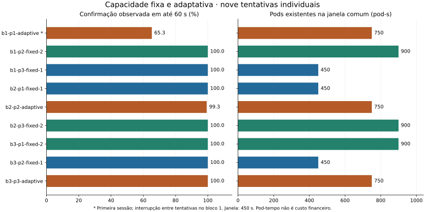
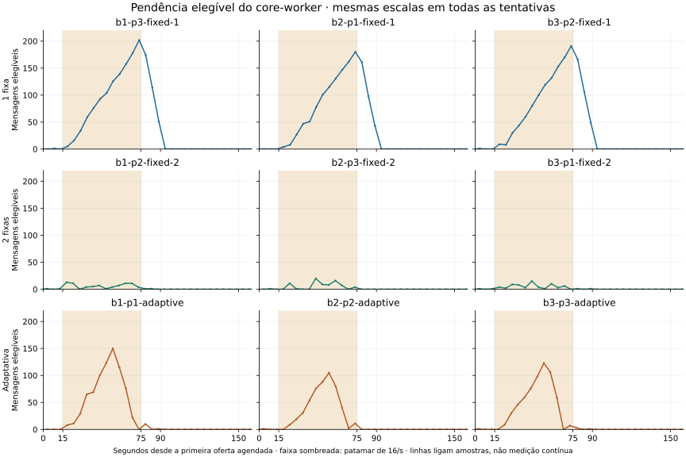
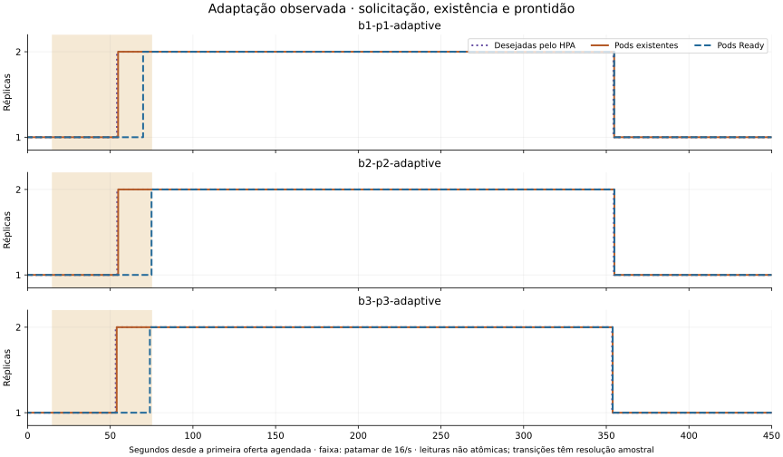

# Avaliação de capacidade fixa e adaptativa em Kubernetes

## 1. Resultado e escopo

A decisão operacional é se a pendência de uma etapa assíncrona justifica manter
capacidade adicional permanentemente ou disponibilizá-la sob demanda. No FulfillFlow,
a pendência do worker e a confirmação do fluxo completo representam fronteiras
diferentes. A avaliação combina atendimento observado, evolução das pendências
e tempo de manutenção das réplicas; expandir pods não constitui benefício por si só.

A comparação avaliou benefícios e limites do autoescalonamento de um worker
assíncrono, mantendo aplicação, demanda, recursos por pod e procedimento de
observação comuns. Foram concluídas nove tentativas em Kind: três com uma réplica,
três com duas e três com KEDA adaptando entre uma e duas. As nove realizaram
integralmente a oferta de 1.020 eventos; os 9.180 aceitos foram confirmados, sendo
8.819 em até 60 segundos e 361 depois desse prazo observado.

Uma réplica fixa confirmou todos os aceitos no prazo em cada tentativa e manteve
menos pod-tempo. Duas réplicas reduziram a pendência do worker, sem redução
proporcional do tempo até a confirmação do fluxo completo. A política adaptativa
executou ciclos observados 1→2→1 e incorporou trabalho durante o pico, mas não
apresentou vantagem de atendimento sobre uma réplica fixa neste perfil.

O resultado distingue **capacidade adicional, execução da política e atendimento
observado**. Não estabelece que uma réplica seja melhor em todas as dimensões nem
que KEDA prejudique aplicações assíncronas em geral. São três tentativas por
condição, num único host, com interrupção temporal do primeiro bloco. Resultados
desfavoráveis permanecem no conjunto. A comparação está encerrada e integra a
referência FulfillFlow Infra `v1.1.0-rc.1`.

## 2. Referências e método

### Identidade da execução

| Item | Referência |
| --- | --- |
| Aplicação congelada | [FulfillFlow v1.3.0-rc.1](https://github.com/campos-labs/fulfillflow/tree/9e3a135a00db218643633c7165d3106f0c8285e1), SHA `9e3a135a00db218643633c7165d3106f0c8285e1` |
| Imagem local conferida pelo bootstrap | `fulfillflow-kind-runtime:source-9e3a135a00db`; ID `sha256:582a858debe2ff64d481e810b2d5ae5a1aba6a669516bca36a15eb12e77ec072` |
| Instrumento qualificado | [Infra `6932632`](https://github.com/campos-labs/fulfillflow-infra/tree/6932632ecc07afbef844f6c7483cfc71d0b5799e) |
| Coordenador da continuação | [Infra `5ca5878`](https://github.com/campos-labs/fulfillflow-infra/tree/5ca58782aa3fd85ba3f91f3f280e96e58fafcb43); arquivos originais do instrumento preservados |
| Ambiente | Kind v0.30.0, Kubernetes v1.34.0, um nó Docker Linux/WSL no Windows; [toolchain](../config/kind-toolchain.json) |
| Controlador | KEDA 2.20.2 e HPA; [manifesto e imagens fixados](../config/keda-pilot.json) |
| Coleta | Locust 2.46.6 `HttpSession`, agenda aberta limitada, observador funcional, SQL/Kubernetes/kubelet e logs por pod; [dependências](../uv.lock) |
| Protocolo | [Configuração versionada](../config/scale-comparison.json), SHA-256 `64141222163a7ec40fdf913cf99bdfb79da7c26dbfa0d0d673609f0d805076de` |

O SHA da tag identifica a consolidação, não substitui as referências
executadas. A CI verifica código e configuração; as nove tentativas foram locais.
Contratos estão no [DESIGN](../DESIGN.md#87-capacidade-fixa-e-adaptativa-em-kind);
comandos, no [guia Kubernetes](../k8s/README.md#comparação-de-capacidade-fixa-e-adaptativa).

### Caracterização preservada do equipamento

| Registro histórico | Caracterização disponível |
| --- | --- |
| [Preflight do preparo](evidence/scaling/environment-preflight.json) | Docker informou 12 CPUs lógicas e 8.165.457.920 bytes de memória (7,605 GiB), cgroup v1 |
| `measurement/series.jsonl` das nove tentativas | `instrument.host_total_bytes` registrou 16.847.921.152 bytes (15,691 GiB) de memória total visível ao Windows em todas as amostras |
| Limites não preservados nesses registros | Modelo da CPU, núcleos físicos, RAM nominal instalada, configuração de limites de Docker/WSL e capacidade/allocatable Kubernetes não foram registrados integralmente |

A capacidade informada pelo Docker no preparo não comprova reserva exclusiva nem
configuração invariável durante a campanha. A memória do Windows é a visível ao
sistema, não a memória livre ou a RAM nominal dos módulos. As séries preservam
recursos do nó e memória disponível durante cada tentativa; não substituem os
parâmetros ausentes. Nenhuma consulta atual foi usada para preencher essas lacunas.

### Condições, preparação e medidas

| Parâmetro comum | Definição executada |
| --- | --- |
| Alvo | Somente `core-worker`; demais workloads e capacidade dos nós fixos |
| Condições | `fixed-1`: mínimo=máximo=1; `fixed-2`: mínimo=máximo=2; `adaptive`: mínimo=1, máximo=2 |
| Controlador e coleta | Presentes nas três condições; não é comparação entre instalar e não instalar KEDA |
| Recursos por worker | Request CPU 150m; limite 0,5 CPU; request/limite de memória 384 MiB; [demais recursos e pools](../DESIGN.md#7-recursos-e-conclusão-assíncrona) preservados |
| Estado inicial | Três bancos restaurados do mesmo baseline privado, broker vazio, 1.020 entidades lógicas equivalentes, ANALYZE e estabilização de 30 s; sem aquecimento de negócio |
| Oferta | 15 s a 2/s → 60 s a 16/s → 15 s a 2/s; 1.020 eventos em 90 s |
| Gerador/observador | Teto HTTP 32; observação concorrente 16; `reuse_terminal_reads=true`; sem reenvio automático |
| Prazo funcional | Confirmação observada até 60 s após resposta de aceite; cada aceite pode ser observado até 120 s |
| Janela de capacidade | Primeira oferta agendada até +450 s: 90 s de oferta e 360 s seguintes, independente do término funcional |
| Amostragem | Cadência nominal 5 s; cobertura de inventário até as duas bordas, lacuna máxima admitida 10 s |
| Política | Quantidade de mensagens elegíveis com idade ≥5 s, alvo de uma por réplica; polling KEDA 5 s; estabilização HPA de subida 15 s e descida 300 s; sem escala a zero/fallback |
| Host | Energia conectada, ≥5 GiB livres na entrada e ≥2 GiB durante a tentativa; verificações amostradas, sem prova de exclusividade contínua |

O backlog elegível conta `tracking.apply.v1` em `PENDING` ou `RETRY_WAIT` vencido
na inbox do Core. Pode incluir trabalho em transação ainda não confirmada; não
mede somente espera ociosa nem todo o fluxo. O sinal do scaler acrescenta a idade
mínima de cinco segundos. `BLOCKED`, retry futuro e trabalho concluído são estados
distintos. Acesso SQL de observação é somente leitura; erro não vira zero.

As asserções funcionais identificam o mesmo evento, Tracking, estado esperado de
Order e Notifications `SIMULATED`, com efeitos únicos. Esta última condição não
representa entrega externa. Aceite HTTP 202, ACK, fila vazia e Ready não substituem
essas verificações. O tempo até confirmação inclui agendamento, polling, transporte
e validações do observador; não é tempo puro de processamento.

Uma resposta inesperada a GET, incluindo 503, é registrada e produz
`observation_error` naquele ciclo. O observador volta a consultar o mesmo evento
dentro da janela de observação, sem reenviar o webhook; uma confirmação posterior
pode encerrar sua observação, preservando o erro no histórico HTTP. Um erro de
consulta recuperado não invalida automaticamente a tentativa. Falhas de coleta,
oferta, atribuição, métrica ou condições do host têm critérios próprios de validade;
tardios, pendências e inconclusões são resultados, não motivos para repetir até
aprovar. Essa é a regra executada em
[`observe` e no ciclo de coleta](https://github.com/campos-labs/fulfillflow-infra/blob/6932632ecc07afbef844f6c7483cfc71d0b5799e/scripts/scale_calibration.py#L110)
e em [`judge`](https://github.com/campos-labs/fulfillflow-infra/blob/6932632ecc07afbef844f6c7483cfc71d0b5799e/scripts/scale_comparison.py#L330),
sem alteração retrospectiva dos critérios.

Pod-tempo integra, em degraus, **pods existentes do worker**, incluindo os em
encerramento, nas amostras de uma janela comum. Running, Ready e réplicas desejadas
são sinais distintos. A medida não representa CPU consumida, todos os componentes
do cluster ou custo financeiro. Os limites de 5/60/450 segundos são escolhas do
protocolo, não parâmetros universais ou demonstrados como ótimos.

### Ordem e continuação

Rotações balanceadas por seed `260927` colocaram cada condição uma vez em cada
posição; a ordem dos blocos e os rótulos foram sorteados antes da execução. Isso
não balanceia todas as precedências nem elimina deriva do host. Uma qualificação
separada verificou 1.020 ofertas e margem do gerador, com pico de 17 vagas ocupadas;
não entra nas nove tentativas.

A primeira adaptativa terminou validamente. A guarda de memória impediu o início
da condição seguinte. A emenda preservou essa tentativa e continuou as oito
posições restantes, na ordem original, em outra sessão de aproximadamente 105
minutos. Antes de cada posição, esperou até 180 s por três amostras consecutivas
com a margem exigida, sem reduzir guardas, reiniciar Docker/WSL ou repetir
resultados lentos. **O bloco 1 perdeu continuidade temporal; os blocos 2 e 3
foram contínuos.** O conjunto não é a execução ininterrupta originalmente prevista.

## 3. Atendimento da demanda e capacidade mantida

Cada linha corresponde a uma tentativa, não a uma média de eventos independentes.
Fonte: [CSV derivado](evidence/scaling/attempts.csv) e
[resumo original em projeção de caminhos](evidence/scaling/comparison-summary.projection.json).

| Tentativa | Confirmados ≤60 s / aceitos | Tardios | p95 observado (s) | Pod-s existentes | Pico elegível |
| --- | ---: | ---: | ---: | ---: | ---: |
| `b1-p1-adaptive` | 666/1020 | 354 | 70,656 | 750,047 | 150 |
| `b1-p2-fixed-2` | 1020/1020 | 0 | 54,015 | 900,000 | 13 |
| `b1-p3-fixed-1` | 1020/1020 | 0 | 57,984 | 450,000 | 202 |
| `b2-p1-fixed-1` | 1020/1020 | 0 | 57,859 | 450,000 | 180 |
| `b2-p2-adaptive` | 1013/1020 | 7 | 58,875 | 750,109 | 105 |
| `b2-p3-fixed-2` | 1020/1020 | 0 | 57,609 | 900,000 | 20 |
| `b3-p1-fixed-2` | 1020/1020 | 0 | 57,063 | 900,000 | 15 |
| `b3-p2-fixed-1` | 1020/1020 | 0 | 57,000 | 450,000 | 191 |
| `b3-p3-adaptive` | 1020/1020 | 0 | 57,797 | 749,954 | 123 |



As barras mantêm a tentativa desfavorável visível. Os 361 tardios são confirmações
observadas após 60 s; todos foram confirmados dentro da observação disponível.
Isso não comprova que o processamento de negócio desses eventos durou mais de 60 s.

Medianas **entre as três tentativas** de cada condição:

| Medida | Uma fixa | Duas fixas | Adaptativa |
| --- | ---: | ---: | ---: |
| p95 de confirmação observado (s) | 57,859 | 57,063 | 58,875 |
| Pico amostrado de pendência elegível | 191 | 15 | 123 |
| Maior idade elegível amostrada (s) | 13,319 | 0,517 | 6,950 |
| Pod-s existentes | 450,000 | 900,000 | 750,047 |
| Drain de confirmação observado após fim da oferta (s) | 46,484 | 45,750 | 47,812 |

Fonte: [estatísticas reproduzíveis](evidence/scaling/statistics.json). A mediana dos
p95 não é o p95 dos 3.060 eventos reunidos. Drain observado não é tempo de esvaziar
a fila nem conclusão instantânea da última operação interna.

Na janela adotada, a adaptativa manteve cerca de 16,7% menos pod-tempo que duas
réplicas fixas e 66,7% mais que uma. Uma réplica foi mais favorável nos dois eixos
principais, mas acumulou mais pendência local. Nenhuma condição é declarada
superior em todas as dimensões; não foram estimadas significância ou equivalência.

## 4. Pendência local e reação da política



Linhas ligam amostras; não representam medição contínua. A figura mostra os primeiros
160 s para leitura da formação/drenagem, com dados da janela completa no
[CSV de séries](evidence/scaling/series.csv). Nas condições fixas, capacidade
adicional disponível desde o início reduziu fortemente a pendência observada.
Essa diferença não se refletiu proporcionalmente na confirmação do fluxo completo.
A comparação não isolou qual etapa ou parcela da observação explica essa relação.



Nas três adaptativas, o inventário registrou 1→2→1. O novo pod teve sua primeira
conclusão DONE em aproximadamente 55–56 s desde a primeira oferta; o patamar intenso
terminava aos 75 s. Os pods adicionais concluíram 276, 248 e 270 trabalhos,
respectivamente; 228, 211 e 228 conclusões ocorreram durante o patamar. Atribuição
vem dos logs por pod correlacionados ao aceite, não da prontidão. Primeiro DONE
não é início de processamento; o alinhamento usa UTC, sujeito aos relógios.

O retorno a um pod foi amostrado em aproximadamente 354–355 s. A maior parte dos
cerca de 300 pod-s adicionais ocorreu após o patamar intenso; parte desse intervalo
ainda podia atender trabalho acumulado, portanto não é todo declarado ocioso.
A proporção depende da janela e da estabilização adotadas. A redução após o trabalho
terminar não testa retirada de pod enquanto processa uma mensagem.

Os marcos de expansão foram próximos, apesar das 354, sete e zero confirmações
tardias. Esses registros, isoladamente, não permitem atribuir essa variação ao
tempo de reação do controlador. Leituras do HPA, inventário e SQL são não atômicas:
as figuras não decompõem exatamente atrasos de detecção, decisão, inicialização
e processamento.

## 5. Validade, sensibilidade e preparação

Nos blocos contínuos 2 e 3, a adaptação teve sete e zero tardios; ambas as fixas
tiveram zero. A ausência de vantagem de atendimento não depende exclusivamente da
primeira adaptativa, embora a magnitude da diferença dependa muito dela. A
interrupção posterior não explica retroativamente seu resultado nem autoriza
excluí-lo. Sessão e bloco continuam identificados nas tabelas e fontes.

Cinco GETs 503 recuperados foram preservados: dois em `notifications` de
`b1-p2-fixed-2`, dois em `carrier-events` de `b2-p3-fixed-2` e um em `notifications`
de `b3-p3-adaptive`. Essas tentativas confirmaram todos os aceitos no prazo; as duas
adaptativas com tardios tiveram zero respostas não-200 no resumo. Os 503 registrados
não explicam diretamente os 361 atrasos. Causas permanecem indeterminadas; sucesso
posterior não apaga erro, e ausência de erro HTTP não prova ausência de outros limites.

Todos os encerramentos foram confirmados. O mínimo de memória livre variou de
2,995 a 4,431 GiB entre tentativas, acima da guarda de 2 GiB. Não há monitoramento
completo de temperatura, frequência, aplicativos externos ou todos os intervalos
entre amostras. Restauração lógica não iguala caches físicos. Mais pods podem
produzir mais leituras, mesmo sob o mesmo procedimento. Há três repetições por
condição, escolhidas por orçamento; 9.180 eventos não equivalem a 9.180 repetições.

Os ensaios preparatórios justificam o protocolo, sem integrar seus denominadores:

| Etapa histórica | Contribuição para o desenho final |
| --- | --- |
| Calibrações e diagnóstico do gerador | Distinguir oferta não realizada de evento aceito; conferir participação de duas réplicas |
| Observação e controle do host | Reutilizar leituras terminais preservando asserções; identificar custo do instrumento e guardar condições do notebook |
| Capacidade fixa e pilotos KEDA | Separar pendência local de confirmação, pressão transitória de sustentada e solicitação de escala de participação real |
| Oferta sustentada 1.019/1.020 | Justificar margem comum do cliente; preservar a execução como exploratória, sem convertê-la em repetição válida |
| Qualificação e continuação | Padronizar estado, janela e instrumento; preservar a primeira tentativa e explicitar a interrupção |

O [histórico anterior à consolidação](https://github.com/campos-labs/fulfillflow-infra/blob/58f4483e0fdb2e5273b9b533d9173de494818a3c/RELEASE_PLAN.md)
registra detalhes e destinos locais desses ensaios. Os originais foram preservados;
não houve nova carga nem alteração retrospectiva do protocolo para aprovar resultados.

## 6. Interpretação conjunta e continuidade

Esta avaliação e a [avaliação de recuperação](OPERATIONAL_EVALUATION.md) são duas
avaliações experimentais complementares sobre a mesma aplicação. Na recuperação,
o acionamento integrado dispensou a solicitação externa separada; ambos os
procedimentos restauraram e confirmaram o trabalho. Aqui, a adaptação executou a
política e incorporou capacidade, sem demonstrar melhor atendimento que uma réplica
fixa. Executar a ação automatizada e melhorar o resultado funcional são dimensões
distintas. Os protocolos não testaram atuação conjunta de recuperação e escala;
tempos, denominadores e resultados não são combinados numa medida geral.

O relatório permite ler os resultados como benefícios/limites do autoescalonamento,
como escolha entre capacidade fixa e adaptativa, ou junto à recuperação como
avaliação da automação operacional. São recortes dos mesmos dados, não novas
campanhas ou confirmações independentes.

Os [contratos da aplicação congelada](https://github.com/campos-labs/fulfillflow/blob/9e3a135a00db218643633c7165d3106f0c8285e1/DESIGN.md)
explicam persistência, idempotência e retomada. Contrato descrito, teste implementado
e execução registrada têm alcances diferentes. As evidências locais verificam
o fluxo e a participação concorrente nesta referência; não comparam arquiteturas
nem importam benchmarks de v1.0/v1.1 ou recuperação pós-ACK da v1.2 como resultados
da v1.3. A [demonstração da aplicação](https://github.com/campos-labs/fulfillflow/blob/9e3a135a00db218643633c7165d3106f0c8285e1/docs/DEMO.md)
ilustra a interface, não estas tentativas no Kind. As figuras acima são derivadas
dos registros, não capturas reconstruídas de uma execução histórica.

Possibilidades futuras, condicionadas a uma necessidade explícita:

| Possibilidade | Questão e critério de continuidade |
| --- | --- |
| OpenTelemetry | Distinguir aceitação, conclusão de negócio por etapa e confirmação pelo observador. Continuar se a correlação acrescentar diagnóstico verificável com custo aceitável; medir também o instrumento. Não depender de reproduzir os 503 históricos. |
| Prometheus/Grafana | Padronizar séries, consultas e apresentação quando o coletor atual não atender à necessidade. Não substituem identidade e conclusão dos eventos. |
| Verificações de segurança | Identificar lacuna concreta em código, dependências, imagens ou IaC, com tratamento dos achados. Não são evidência de ganho de escala e não alteram silenciosamente imagens congeladas. |
| AKS | Verificar portabilidade e funcionamento selecionado em nuvem; registrar ambiente, custos e evidências próprios. ACR depende da implantação escolhida. Quantificação em nuvem exigiria protocolo e repetições correspondentes. |

Instrumentação, destino da telemetria e ambiente são decisões separadas. Uma futura
referência instrumentada deve identificar alterações de código, dependências e
runtime, inclusive autoinstrumentação. Para afirmar melhora de diagnóstico, definir
comparação e critérios antes de medir. Dados novos podem investigar hipóteses, mas
não determinar retroativamente causas que os registros antigos não preservaram.

## 7. Evidências e reprodução da leitura

O [manifesto](evidence/scaling/manifest.json) identifica arquivos, origem, natureza
e SHA-256. Os três ZIPs reúnem **todas as pastas das nove tentativas, byte a byte**,
inclusive a primeira adaptativa originalmente armazenada fora da continuação.
Os contêineres ZIP são novos; os registros internos e seus manifests originais
não foram reescritos. Bloco é agrupamento planejado, não sessão contínua.

| Pacote | Conteúdo | Bytes |
| --- | --- | ---: |
| [block-01.zip](evidence/scaling/archives/block-01.zip) | Três tentativas do bloco 1; metadados selecionados de qualificação, protocolo e sessão | 6.932.840 |
| [block-02.zip](evidence/scaling/archives/block-02.zip) | Três tentativas do bloco 2 | 6.830.838 |
| [block-03.zip](evidence/scaling/archives/block-03.zip) | Três tentativas do bloco 3 | 6.833.055 |

[Checksums dos ZIPs](evidence/scaling/archives/checksums.sha256). As projeções de
resumo, revisão e emenda apenas substituem caminhos absolutos do repositório por
relativos; hashes dos arquivos-fonte permanecem no manifesto. Dados sintéticos,
UIDs e referências opacas a secrets são preservados, sem valores de credenciais.
Snapshots privados, kubeconfigs e marcadores privados não são publicados. A
qualificação tem metadados selecionados, não um pacote bruto integral. A leitura
das nove tentativas é autossuficiente; estes arquivos não são backup nem instalador.

| Afirmação | Fonte e campo relevante | Natureza/localização |
| --- | --- | --- |
| Oferta, prazo e tempos | `<tentativa>/comparison-result.json`; `planned`, `accepted`, `counts`, `confirmation_observed_seconds`; `measurement/events.json` | Originais nos ZIPs; [CSV de eventos](evidence/scaling/events.csv) derivado |
| Pendência e pod-tempo | `measurement/series.jsonl`, `window.json`; `inbox`, `pod_inventory`, relógios de observação | Originais nos ZIPs; [séries](evidence/scaling/series.csv) derivadas |
| Configuração aplicada | `protocol.json`, `measurement/actual-controller.json`; `minReplicaCount`/`maxReplicaCount` | Originais nos ZIPs; não confundir com o template `measurement/policy.json` |
| Participação do novo pod | `measurement/worker-attribution.json`; `records`, `per_pod`; aceite por `request_id` | Originais nos ZIPs; [revisão](evidence/scaling/review.projection.json) com marcos derivados |
| Cinco falhas de consulta | `measurement/event-*/http-timings.json`; `http_status`, endpoint e correlação | Originais nos ZIPs; `http_failures` na revisão aponta as ocorrências |
| Estado inicial/host/encerramento | `initial-state.json`, `host-conditions.jsonl`, `host-review.json`, `shutdown.json` | Originais em cada tentativa |
| Continuação e sessões | [Emenda](evidence/scaling/continuation.projection.json), `metadata/.../starts` e `sessions` no bloco 1 | Projeção identificada e registros originais; bloco 1 interrompido |

Campos legados `purpose: KEDA bounded pilot`, `next: pause for pilot review` e
`autoscaling_tested` identificam a origem do executor; não significam que as
condições fixas adaptaram réplicas. O protocolo formal, a configuração aplicada,
o inventário e `comparison-result.json` definem a leitura desta campanha.

O [reprodutor offline](evidence/scaling/reproduce.py) verifica os ZIPs, 18.594
entradas dos manifests originais e reproduz contagens, p95, pod-tempo e tabelas.
Não usa cluster, diretório privado ou rede. Na raiz do checkout, com Python 3.12:

```powershell
python docs/evidence/scaling/reproduce.py
python docs/evidence/scaling/reproduce.py --output artifacts/scaling-reading-01
# Ambiente temporário de apresentação; não altera uv.lock nem o instrumento medido.
uv run --no-project --with matplotlib==3.10.8 python docs/evidence/scaling/reproduce.py --output artifacts/scaling-figures-01 --plots
```

Os destinos devem ser novos. A terceira linha pode baixar dependências na primeira
execução; depois de disponíveis, a reprodução usa somente dados locais. SVGs e
PNGs são gerados com Matplotlib 3.10.8; CSVs usam ponto decimal. Scripts da campanha
continuam versionados em `scripts/`; sua execução requer ambiente e imagem
compatíveis e outra autorização de carga. Não foi verificada reprodução das
medições em outro computador nem restauração dos volumes por backup independente.
